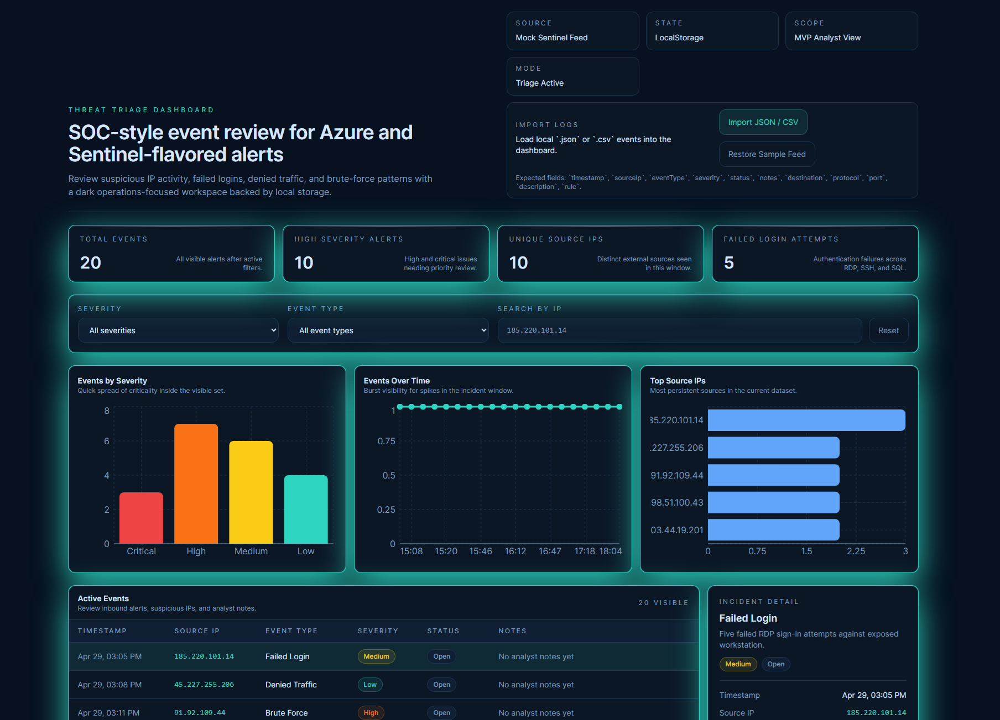
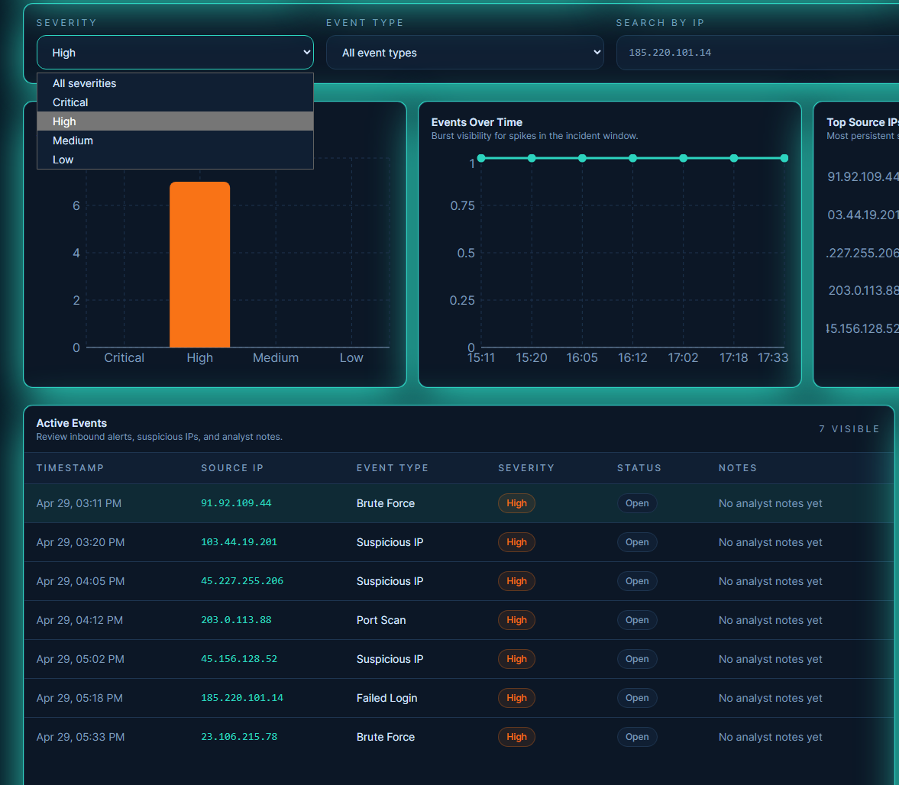
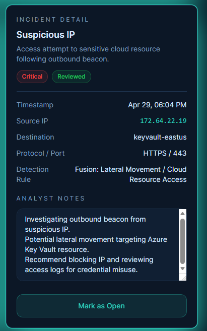
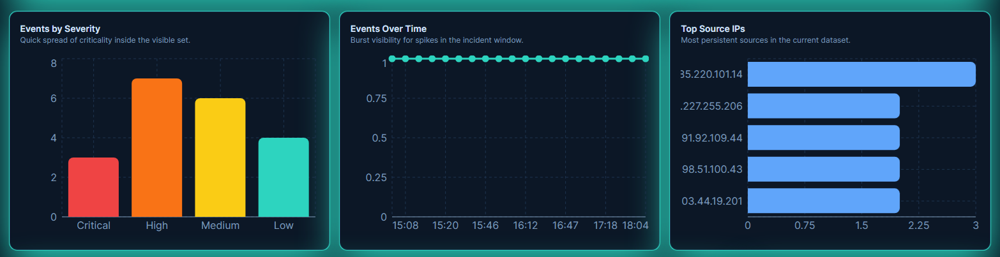

# Threat Triage Dashboard

**SOC-style security event triage dashboard for reviewing suspicious activity, documenting analyst notes, and tracking incident status across simulated cloud and endpoint alerts.**

## Overview

Threat Triage Dashboard is a cybersecurity-focused frontend project designed to simulate a lightweight Security Operations Center (SOC) workflow.

The application presents realistic mock security events inspired by Azure, Microsoft Sentinel, NSG flow logs, authentication failures, and common incident patterns such as brute-force activity, denied traffic, suspicious IPs, malware beaconing, and port scans.

The goal of the project is to demonstrate how a SOC analyst might:
- monitor incoming alerts
- identify high-priority events
- filter suspicious activity by severity and event type
- investigate event details
- document analyst notes
- track review status during triage

This project is intentionally built as an MVP with a frontend-first architecture using LocalStorage instead of a backend so the core triage workflow can be demonstrated clearly.

## Why This Project Is Relevant to SOC / Cybersecurity Work

This project is meant to reflect common defensive security tasks rather than generic dashboard development.

It maps well to entry-level and junior SOC responsibilities such as:
- reviewing security alerts
- prioritizing events by severity
- investigating source IP activity
- recognizing suspicious authentication patterns
- documenting findings
- tracking analyst review progress
- working with cloud/security telemetry concepts

While the data is simulated, the workflow is aligned with real security monitoring and triage thinking.

## Features

- Dashboard overview cards for:
  - Total events
  - High severity alerts
  - Unique source IPs
  - Failed login attempts
- Filterable event table with:
  - Timestamp
  - Source IP
  - Event type
  - Severity
  - Status
  - Analyst notes
- Search and filtering by:
  - Severity
  - Event type
  - Source IP
- Visualizations for:
  - Events by severity
  - Events over time
  - Top source IPs
- Incident detail panel for:
  - inspecting event details
  - recording analyst notes
  - marking events as reviewed
- Import support for local `.json` and `.csv` event files
- Persistent local state using LocalStorage

## Tech Stack

- **React**
- **TypeScript**
- **Tailwind CSS**
- **Recharts**
- **Vite**
- **LocalStorage**

## Screenshots

The following screenshots highlight the core SOC-style workflow of the Threat Triage Dashboard, including event monitoring, filtering, and incident review.

### Dashboard Overview
Displays high-level security metrics, severity distribution, and event trends to support rapid situational awareness.


### Filtered Event View
Demonstrates filtering by severity, event type, and source IP to isolate suspicious activity during triage.


### Incident Detail Panel
Shows detailed event inspection, analyst note-taking, and status tracking for individual alerts.


### Charts and Event Trends
Visualizes event distribution, activity over time, and top source IPs to help identify patterns and anomalies.


## How to Run Locally

### Prerequisites

- Node.js
- npm

### Install and Start

```bash
npm install
npm run dev
```

Then open the local development URL shown in the terminal.

## Import Format

The dashboard supports:
- `.json` files containing an array of event objects
- `.csv` files with these headers:

```text
timestamp,sourceIp,eventType,severity,status,notes,destination,protocol,port,description,rule
```

Sample event files are included in the `public/` folder.

## Security Concepts Demonstrated

This project demonstrates familiarity with several security monitoring and triage concepts, including:

- **Alert triage**
- **Severity-based prioritization**
- **Authentication failure analysis**
- **Brute-force detection patterns**
- **Suspicious IP review**
- **Port scan recognition**
- **Denied traffic analysis**
- **Incident documentation**
- **Cloud/SIEM-inspired event workflows**
- **Analyst review tracking**

It also reflects concepts commonly seen in tools and environments such as:
- Microsoft Sentinel
- Azure NSG flow logs
- Windows authentication events
- Linux authentication logs
- cloud security monitoring workflows

## Project Structure

```text
src/
  components/
  data/
  lib/
  App.tsx
  main.tsx
  index.css
```

## Future Improvements

Possible next steps for the project include:

- real backend persistence
- user authentication and role-based access
- event ingestion from external APIs or live log sources
- more robust CSV parsing and validation
- analyst tagging and incident categorization
- reviewed vs open metrics
- exportable analyst notes
- MITRE ATT&CK mapping
- detection rule management
- deployment with a public live demo

## Notes

This project is currently an MVP focused on demonstrating triage workflow, UI clarity, and security relevance. It is not intended to replace a production SIEM or incident response platform, but to showcase SOC-oriented thinking and practical frontend implementation.
